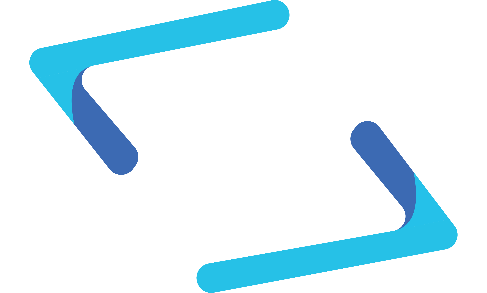

<h3 align="center">

	<br/>
	<br />
	<samp>
			<a href="https://grayisaac.xyz/" target="_blank" >
			「 Isaac Gray 」
			</a>
			<br/>
			software engineer <br/>
			designer & creator
	</samp>
</h3>


<br />

---

<br />

<h3>Hello 👋</h3>

I am primarily a *back-end* software engineer, although I also enjoy the design aspect of *front-end*.

I am interested in *agile* methodologies, software *design patterns*, *DDD* & *TDD*. 

<br/> 

```json
{
	"age": 24,
	"education": [
		"Bachelor of Computer Science",
		"Bachelor of Computer Engineering (Honours)"
	],
	"interests": [
		"music", "running", "climbing", 
		"traveling", "chess", "writing"
	],
	"funFact": "I once ate a carolina reaper for fun"
}
```

<br />

&nbsp;


<br />

---


<br />
<details><summary><samp>&nbsp;&nbsp;Knowledge & Skills ✨ 🔨</samp> </summary>
<br />

📖&nbsp; **Languages**
<br />

&nbsp;

&nbsp;&nbsp;&nbsp;

<br />

📚&nbsp; **Frameworks**
<br />

&nbsp;&nbsp;

&nbsp;&nbsp;


<br />

💾&nbsp; **Data Store**
<br />

&nbsp;


&nbsp;&nbsp;

<br />

⚙️&nbsp; **Technologies**
<br />

&nbsp;

&nbsp;&nbsp;

&nbsp;&nbsp;

&nbsp;

<br/>

💽&nbsp; **Hardware**
<br />

&nbsp;

<br />

📝&nbsp; **UI & UX Design**
<br />

&nbsp;&nbsp;

&nbsp;

<br />

</details>
<br />


<details>
<summary>
<samp>&nbsp;&nbsp;Tools of the Trade ✨ 🛠️</samp>
</summary>
<br />

**Terminal**&nbsp;&nbsp;&nbsp;&nbsp;&nbsp;

<br />
<br />

**OS**
&nbsp;&nbsp;&nbsp;&nbsp;&nbsp;&nbsp;&nbsp;&nbsp;&nbsp;&nbsp;&nbsp;&nbsp;&nbsp;&nbsp;
&nbsp;
<br />
<br />

**Browser**&nbsp;&nbsp;&nbsp;&nbsp;&nbsp;


<br />
<br />

**IDE**&nbsp;&nbsp;&nbsp;&nbsp;&nbsp;&nbsp;&nbsp;&nbsp;&nbsp;&nbsp;&nbsp;&nbsp;&nbsp;&nbsp;


<br />
<br />

**Notes**&nbsp;&nbsp;&nbsp;&nbsp;&nbsp;&nbsp;&nbsp;&nbsp;&nbsp;


<br />
<br />

**Text Proc.**&nbsp;&nbsp;


<br />
<br />
</details>

<br />

---

<br />


